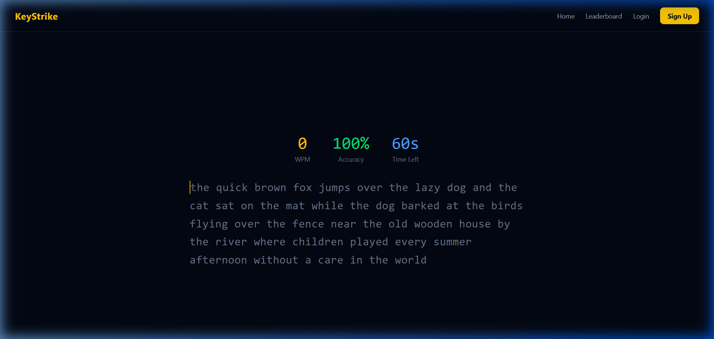
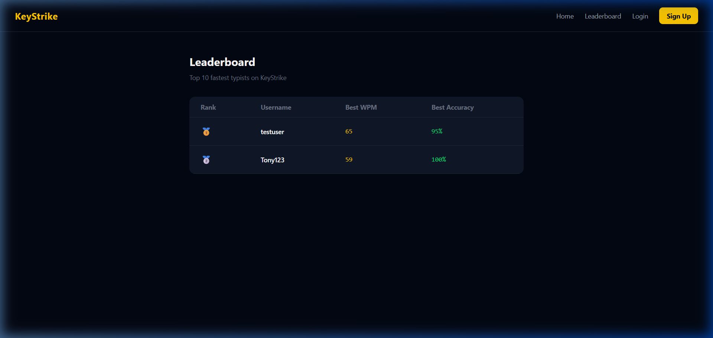

# ⌨️ KeyStrike

A full-stack typing speed test application built with React, Node.js, Express, and MongoDB.
Test your typing speed, track your progress, and compete on the global leaderboard.

🔗 **Live Demo:** [keystrike-typing.vercel.app](https://keystrike-typing.vercel.app)

---

## 🚀 Features

- ⚡ Real-time WPM and accuracy calculation
- 🔐 User authentication with JWT (Register / Login)
- 📊 Personal dashboard with best WPM, avg WPM & accuracy
- 🏆 Global leaderboard — top 10 fastest typists
- 💾 All results saved to MongoDB
- 📱 Responsive design with Tailwind CSS

---

## 🛠️ Tech Stack

| Layer | Technology |
|---|---|
| Frontend | React, Vite, Tailwind CSS |
| Backend | Node.js, Express.js |
| Database | MongoDB, Mongoose |
| Auth | JWT, bcryptjs |
| Deployment | Vercel (frontend), Render (backend) |

---

## 📁 Project Structure

```
keystrike/
├── frontend/          # React + Vite app
│   └── src/
│       ├── pages/     # Home, Login, Register, Dashboard, Leaderboard
│       ├── components/# Navbar
│       ├── context/   # AuthContext
│       └── services/  # Axios API calls
├── backend/           # Express REST API
│   ├── models/        # User, Result schemas
│   ├── routes/        # auth, results routes
│   └── middleware/    # JWT auth middleware
└── README.md
```

---

## ⚙️ Run Locally

### Prerequisites
- Node.js v18+
- MongoDB Atlas account (or local MongoDB)

### 1. Clone the repo
```bash
git clone https://github.com/YOUR_USERNAME/keystrike.git
cd keystrike
```

### 2. Setup Backend
```bash
cd backend
npm install
```
Create a `.env` file in `/backend`:
```
PORT=5000
MONGO_URI=your_mongodb_connection_string
JWT_SECRET=your_jwt_secret
```
```bash
npm run dev
```

### 3. Setup Frontend
```bash
cd frontend
npm install
npm run dev
```

Visit `http://localhost:5173`

---

## 📸 Screenshots

### Home Page


### Leaderboard


---

## 📄 License

MIT License — feel free to fork and build on it!
